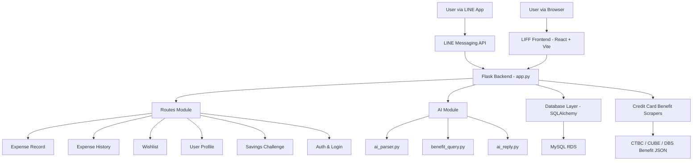

# Financial Agent

## 📘 專案簡介（繁體中文）
Financial Agent 是一款以 **LINE Bot + Flask 後端 + MySQL** 所構成的智慧理財助理。  
使用者可直接透過 LINE 完成記帳、查詢消費、管理慾望清單、儲蓄挑戰、信用卡回饋比對等操作。  
系統採模組化架構、AI 模組分離、SQLAlchemy ORM、信用卡回饋爬蟲，並支援 AWS EC2 部署。

## 📘 Project Overview (English)
Financial Agent is an intelligent financial assistant built with **LINE Messaging API, Flask backend, and MySQL**.  
Users can record expenses, manage wishlists, run savings challenges, and query credit‑card benefits—directly within LINE.  
The backend is fully modularized with separated AI logic and deployable on AWS EC2.

---
## 使用者介面
```
┌────────────┬────────────┬────────────┐
│   Area A   │   Area B   │            │  ← 上半部 (y=0 ~ 421)
├────────────┼────────────│   Area C   │
│   Area D   │   Area E   │            │  ← 下半部 (y=421 ~ 843)
└────────────┴────────────┴────────────┘
```

# 🏛 System Architecture / 系統架構圖



---

# 📦 Core Features / 核心功能

### 繁中
- 記帳（「午餐 120」）
- 消費紀錄查詢統計
- 慾望清單管理
- 儲蓄挑戰自動規劃
- AI 信用卡回饋比對
- LIFF 個人資料填寫（含 Google Login）

### English
- Expense recording
- Spending summaries
- Wishlist management
- Automated saving challenge generation
- AI credit card benefit matching
- LIFF profile setup

---

# 📁 Project Structure / 專案結構

```
backend
├── ai
│   ├── ai_parser.py
│   ├── ai_reply.py
│   ├── benefit_query.py
│   ├── format_benefit_summary.py
│   └── test_full_flow.py
├── app.py
├── base_models.py
├── database.py
├── linebot_handler.py
├── main.py
├── models
│   ├── user.py
│   ├── wishlist.py
│   ├── record.py
│   ├── expense_model.py
│   ├── credit_card_benefit_model/
│   │   ├── ctbc_linepay_benefits_model.py
│   │   ├── ctbc_linepay_debit_benefits_model.py
│   │   ├── cube_benefits_model.py
│   │   └── dbs_eco_benefits_model.py
├── routes
│   ├── auth.py
│   ├── challenge.py
│   ├── expense_history.py
│   ├── expense_record.py
│   ├── linebot.py
│   ├── profile.py
│   ├── wishlist.py
│   └── credit_card/
│       ├── cube_benefits_scraper.py
│       ├── ctbc_linepay_benefits_scraper.py
│       ├── dbs_eco_benefits_scraper.py
│       ├── cube_benefits_list.json
│       ├── ctbc_linepay_benefits.json
│       ├── dbs_eco_benefits.json
│       └── dbs_eco_raw_benefits.json
├── setup_rich_menu.py
├── templates/
└── requirements.txt
```

---

# ⚙️ Backend Overview / 後端架構

### 繁中
- `app.py`：後端主入口，註冊 Blueprint、初始化資料庫
- `routes/`：所有 API 端點
- `ai/`：AI 模組（自然語言解析、信用卡回饋查詢）
- `models/`：SQLAlchemy ORM 模型
- `database.py`：資料庫連線
- `setup_rich_menu.py`：LINE Rich Menu 建立工具

### English
- `app.py`: main entry point
- `routes/`: API endpoints
- `ai/`: AI logic modules
- `models/`: ORM models
- `database.py`: DB connection
- `setup_rich_menu.py`: rich menu tool

---

# 🌐 Frontend Overview

React + Vite + LIFF 用於：
- Google Login
- 個人資料填寫
- 顯示消費紀錄與進度條

---

# 🔌 API Overview

```
POST /expense_record
GET  /expense_history
POST /wishlist
GET  /wishlist
DELETE /wishlist/{id}
POST /profile/update
POST /credit_card/query
```

---

# 🗄 Database Schema

### users
| id | provider | provider_id | name | email |

### wishlist
| id | item_name | price | user_id |

### expense
| id | category | amount | timestamp | user_id |

### credit_card_benefits
各銀行為獨立 table。

---

# 🚀 Setup & Run（安裝與啟動）

### Backend
```bash
cd backend
pip install -r requirements.txt
python3 app.py
```

### Frontend
```bash
cd frontend
npm install
npm start
```

---

# ☁️ Deployment（部署）

```bash
ssh ubuntu@<EC2-IP>
cd financial-agent
git pull
cd backend
python3 app.py
```

---

# 📙 Developer Guide（開發者手冊）

以下為完整開發手冊，整合同學原始筆記。

---

## 🖥 EC2 SSH
```bash
ssh ubuntu@18.222.158.104
```

## 🗄 RDS MySQL
```bash
mysql -h financial-agent.cpwk2ce8cqyu.us-east-2.rds.amazonaws.com \
      -P 3306 -u nycuiemagent -p
```

## 🌐 WSL DNS 修正
```bash
sudo nano /etc/wsl.conf
```

## 💾 虛擬環境
```bash
python3 -m venv venv
source venv/bin/activate
```

## 🧪 測試
```bash
python3 backend/ai/test_full_flow.py
python3 -m backend.app
python3 -m backend.routes.credit_card.cube_benefit_scraper
```

## 🪝 Rich Menu
```bash
python3 setup_rich_menu.py
```

## 🔧 Git Flow
```bash
git checkout main
git pull
git checkout feature-login
git merge origin/main
```

## 網站本地登入
```bash
#先跑
python3 -m backend.app
#測試網址：http://localhost:8000/dashboard

```

## 下載套件
```bash
pip install -r requirements.txt
```

## 🌏 時區
```bash
sudo timedatectl set-timezone Asia/Taipei
```

---

# 🎯 Notes
- `ai_parser.py` 與 `benefit_query.py` 仍持續優化中  
- LINE 回覆若顯示舊版本，多為 EC2 未更新 branch 或未重新啟動  

---


# 在EC2上更新程式碼方式(常駐時)
```bash
cd /home/ubuntu/financial-agent
git pull
source venv/bin/activate

# 如果你有新增/更新套件（建議每次都跑一次也行）
pip install -r requirements.txt

# 重啟服務讓新程式碼生效
sudo systemctl restart financial-agent

# 檢查狀態
sudo systemctl status financial-agent --no-pager
```

# 把常駐方案停掉
```bash
#停止
sudo systemctl stop financial-agent

#確認真的停了
sudo systemctl status financial-agent --no-pager
#應該要顯示 Active: inactive (dead)

#再次確認
ss -ltnp | grep :8000
#如果沒有輸出，代表 gunicorn 已停止。

```


# ✅ 完成
此 README 已為你整合成完整技術導向 + 雙語版本，可直接使用於 GitHub。  
 