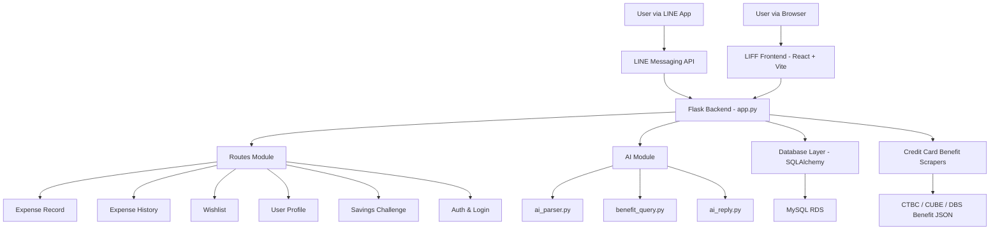

# Financial Agent

## 📘 專案簡介（繁體中文）
Financial Agent 是一款以 **LINE Bot + Flask 後端 + MySQL** 所構成的智慧理財助理。  
使用者可直接透過 LINE 完成記帳、查詢消費、管理慾望清單、儲蓄挑戰、信用卡回饋比對等操作。  
系統採模組化架構、AI 模組分離、SQLAlchemy ORM、信用卡回饋爬蟲，並支援 AWS EC2 部署。

## 📘 Project Overview (English)
Financial Agent is an intelligent financial assistant built with **LINE Messaging API, Flask backend, and MySQL**.  
Users can record expenses, manage wishlists, run savings challenges, and query credit‑card benefits—directly within LINE.  
The backend is fully modularized with separated AI logic and deployable on AWS EC2.

---
## 使用者介面
```
┌────────────┬────────────┬────────────┐
│   Area A   │   Area B   │            │  ← 上半部 (y=0 ~ 421)
├────────────┼────────────│   Area C   │
│   Area D   │   Area E   │            │  ← 下半部 (y=421 ~ 843)
└────────────┴────────────┴────────────┘
```

# 🏛 System Architecture / 系統架構圖


```mermaid
graph TD

A[User via LINE App] --> B[LINE Messaging API]
B --> C[Flask Backend - app.py]

C --> C1[Routes Module]
C --> C2[AI Module]
C --> C3[Database Layer - SQLAlchemy]
C --> C4[Credit Card Benefit Scrapers]

C1 --> D1[Expense Record]
C1 --> D2[Expense History]
C1 --> D3[Wishlist]
C1 --> D4[User Profile]
C1 --> D5[Savings Challenge]
C1 --> D6[Auth & Login]

C2 --> E1[ai_parser.py]
C2 --> E2[benefit_query.py]
C2 --> E3[ai_reply.py]

C3 --> F[MySQL RDS]
C4 --> G[CTBC / CUBE / DBS Benefit JSON]

User2[User via Browser] --> LIFF[LIFF Frontend - React + Vite]
LIFF --> C
```

---

# 📦 Core Features / 核心功能

### 繁中
- 記帳（「午餐 120」）
- 消費紀錄查詢統計
- 慾望清單管理
- 儲蓄挑戰自動規劃
- AI 信用卡回饋比對
- LIFF 個人資料填寫（含 Google Login）

### English
- Expense recording
- Spending summaries
- Wishlist management
- Automated saving challenge generation
- AI credit card benefit matching
- LIFF profile setup

---

# 📁 Project Structure / 專案結構

```
backend
├── ai
│   ├── ai_parser.py
│   ├── ai_reply.py
│   ├── benefit_query.py
│   ├── format_benefit_summary.py
│   └── test_full_flow.py
├── app.py
├── base_models.py
├── database.py
├── linebot_handler.py
├── main.py
├── models
│   ├── user.py
│   ├── wishlist.py
│   ├── record.py
│   ├── expense_model.py
│   ├── credit_card_benefit_model/
│   │   ├── ctbc_linepay_benefits_model.py
│   │   ├── ctbc_linepay_debit_benefits_model.py
│   │   ├── cube_benefits_model.py
│   │   └── dbs_eco_benefits_model.py
├── routes
│   ├── auth.py
│   ├── challenge.py
│   ├── expense_history.py
│   ├── expense_record.py
│   ├── linebot.py
│   ├── profile.py
│   ├── wishlist.py
│   └── credit_card/
│       ├── cube_benefits_scraper.py
│       ├── ctbc_linepay_benefits_scraper.py
│       ├── dbs_eco_benefits_scraper.py
│       ├── cube_benefits_list.json
│       ├── ctbc_linepay_benefits.json
│       ├── dbs_eco_benefits.json
│       └── dbs_eco_raw_benefits.json
├── setup_rich_menu.py
├── templates/
└── requirements.txt
```

---

# ⚙️ Backend Overview / 後端架構

### 繁中
- `app.py`：後端主入口，註冊 Blueprint、初始化資料庫
- `routes/`：所有 API 端點
- `ai/`：AI 模組（自然語言解析、信用卡回饋查詢）
- `models/`：SQLAlchemy ORM 模型
- `database.py`：資料庫連線
- `setup_rich_menu.py`：LINE Rich Menu 建立工具

### English
- `app.py`: main entry point
- `routes/`: API endpoints
- `ai/`: AI logic modules
- `models/`: ORM models
- `database.py`: DB connection
- `setup_rich_menu.py`: rich menu tool

---

# 🌐 Frontend Overview

React + Vite + LIFF 用於：
- Google Login
- 個人資料填寫
- 顯示消費紀錄與進度條

---

# 🔌 API Overview

```
POST /expense_record
GET  /expense_history
POST /wishlist
GET  /wishlist
DELETE /wishlist/{id}
POST /profile/update
POST /credit_card/query
```

---

# 🗄 Database Schema

### users
| id | provider | provider_id | name | email |

### wishlist
| id | item_name | price | user_id |

### expense
| id | category | amount | timestamp | user_id |

### credit_card_benefits
各銀行為獨立 table。

---

# 🚀 Setup & Run（安裝與啟動）

### Backend
```bash
cd backend
pip install -r requirements.txt
python3 app.py
```

### Frontend
```bash
cd frontend
npm install
npm start
```

---

# ☁️ Deployment（部署）

## SSH 連線
```bash
ssh ubuntu@3.133.58.32
```

## 安裝套件
```bash
cd financial-agent
source venv/bin/activate
# 先裝 CPU 版 torch（避免拉到 nvidia CUDA 套件）
pip install torch --index-url https://download.pytorch.org/whl/cpu
# 再裝其他套件
pip install -r requirements.txt
```

## 背景執行（systemd）
```bash
# 啟動
sudo systemctl start financial-agent

# 確認有跑起來
sudo systemctl status financial-agent --no-pager

# 看即時 log
sudo journalctl -u financial-agent -f
```

## 更新程式碼
```bash
git pull
sudo systemctl restart financial-agent
```

## 停止服務
```bash
sudo systemctl stop financial-agent
```

---

# 📙 Developer Guide（開發者手冊）

以下為完整開發手冊，整合同學原始筆記。

---

## 重開EC2
去NameCheap更改DNS，換Public IPv4 address

## 🖥 EC2 SSH
```bash
ssh ubuntu@3.137.145.151
```

## 🗄 RDS MySQL
```bash
mysql -h financial-agent.cpwk2ce8cqyu.us-east-2.rds.amazonaws.com \
      -P 3306 -u nycuiemagent -p
```

## 🌐 WSL DNS 修正
```bash
sudo nano /etc/wsl.conf
```

## 💾 虛擬環境
```bash
python3 -m venv venv
source venv/bin/activate
```

## 🧪 測試
```bash
python3 backend/ai/test_full_flow.py
python3 -m backend.app
python3 -m backend.routes.credit_card.cube_benefit_scraper
```

## 🪝 Rich Menu
```bash
python3 setup_rich_menu.py
```

## 🔧 Git Flow
```bash
git checkout main
git pull
git checkout feature-login
git merge origin/main
```

## 網站本地登入
```bash
#先跑
python3 -m backend.app
#測試網址：http://localhost:8000/dashboard

```

## 下載套件
```bash
pip install -r requirements.txt
```

## 🌏 時區
```bash
sudo timedatectl set-timezone Asia/Taipei
```

---

# 🔑 API Token 使用總覽

各 pipeline 完成後會向 `user_token_logs` table 寫入一筆 token 用量紀錄（source = pipeline 名稱）。

| Pipeline（source） | 觸發方式 | OpenAI 用量 | Perplexity 用量 |
|---|---|---|---|
| `credit_card` | 使用者詢問信用卡回饋 | orchestrate（意圖判斷）＋ ai_parser（品牌解析）＋ ai_reply（回覆生成） | 無 |
| `daily_news` | 使用者要求每日新聞 | orchestrate ＋ openai_news（摘要生成） | 文章不足時觸發 Perplexity fallback（sonar） |
| `expense` | 記帳（「午餐 150」） | orchestrate | 無 |
| `query_expense` | 查消費紀錄 | orchestrate | 無 |
| `wishlist` | 新增欲望清單 | orchestrate | 無 |
| `tax` | 所得稅試算 | orchestrate | 無 |
| `quiz` | 投資風險屬性測驗 | orchestrate | 無 |
| `financial_qa` | 金融知識問答 | orchestrate | 無 |
| `unknown` | 無法識別意圖 | orchestrate | 無 |

**模型版本**
- OpenAI：`gpt-4o-mini`
- Perplexity：`sonar`

**每日用量上限**：預設 50,000 OpenAI tokens／user／天，可透過 `.env` 的 `DAILY_TOKEN_LIMIT` 調整。超過上限後當天所有請求會被拒絕（Perplexity 不計入，因為 OpenAI 達上限時 pipeline 已被攔截，Perplexity 根本不會被觸發）。

**開發人員白名單**：`backend/utils/token_tracker.py` 的 `WHITELIST_USER_IDS` set，填入開發人員的 `users.id`，白名單內的 user 不受每日上限限制。可執行以下 SQL 查詢 id：
```sql
SELECT id, name FROM users;
```

---

## 📊 Token 用量統計架構

### 資料表
| Table | 說明 |
|---|---|
| `user_token_logs` | 每筆 pipeline 執行的 token 用量，primary key 為 `(user_id, date, source)` |
| `monthly_token_stats` | 系統整體月統計，primary key 為 `(year_month, source)` |

### 月統計彙總（`backend/utils/monthly_stats.py`）

從 `user_token_logs` 彙總出每個 pipeline 當月的總 token、請求次數、不同 user 數，寫入 `monthly_token_stats`。

```bash
# 彙總當月
python3 -m backend.utils.monthly_stats

# 彙總指定月份
python3 -m backend.utils.monthly_stats 2026-04
```

**建議排程**：在 EC2 用 cron 設定每月 1 號自動跑上個月的彙總：
```bash
# crontab -e
5 0 1 * * cd /home/ubuntu/financial-agent && source venv/bin/activate && python3 -m backend.utils.monthly_stats $(date -d "last month" +\%Y-\%m)
```

---

# 🎯 Notes
- `ai_parser.py` 與 `benefit_query.py` 仍持續優化中  
- LINE 回覆若顯示舊版本，多為 EC2 未更新 branch 或未重新啟動  

---


# ml資料夾是做ml 模型
是一個單獨隔離出來的環境，並不會破壞掉原本的主程式

# ✅ 完成
此 README 已為你整合成完整技術導向 + 雙語版本，可直接使用於 GitHub。

# 重開 EC2 方法/ DB
1. 開啟EC2 並記下 public IP
2. 去 namecheap 更改endpoint  public IP
3. 去 .env 更改 database URL(endpoint)
 

---

# 📊 實驗結果

## GRU Transfer Learning（ml_gru）

### 模型設定
- 架構：GRU Transfer Learning（Walmart pretrain → 個人記帳 finetune）
- 輸入：過去 30 天，7 個特徵
- 目標：未來 7 天總消費（`future_expense_7d_sum`）
- 資料切分：**Per-user 時間切分 70/15/15**（每個 user 各自切，避免 user 分佈不一致）

### 實驗紀錄

| 日期 | 切分方式 | Val MAE | Test MAE | Test SMAPE | Test Per-user NMAE | 備注 |
|------|----------|--------:|---------:|-----------:|-------------------:|------|
| 2026-03-25 | 全域 70/15/15 | 6,100 元 | 1,069 元 | — | — | val/test user 分佈嚴重不一致（val 高消費 user，test 低消費 user） |
| 2026-03-25 | Per-user 70/15/15 | 2,556 元 | 3,794 元 | 82.86% | 92.54% | 修正切分方式後 val/test 趨於一致；SMAPE 仍偏高，模型有待改善 |

### Baseline 對比（Test）

| 指標 | GRU | Naive 7d | Moving Avg 30d |
|------|----:|---------:|---------------:|
| MAE  | 3,794 元 | 8,130 元 | 7,019 元 |
| RMSE | 8,504 元 | 23,669 元 | 19,089 元 |

### 相對誤差指標（Per-user 70/15/15）

| Split | MAE | RMSE | SMAPE | Per-user NMAE |
|-------|----:|-----:|------:|--------------:|
| Val   | 2,556 元 | 5,080 元 | 86.75% | 168.53% |
| Test  | 3,794 元 | 8,504 元 | 82.86% | 92.54% |

> **現況與問題**：MAE 已贏過 baseline 兩倍，但 SMAPE ~83% 與 Per-user NMAE ~93% 仍偏高，代表對部分低消費用戶誤差相對其消費金額過大。下一步方向：per-user 誤差分解，找出哪些 user 拉高相對誤差。
