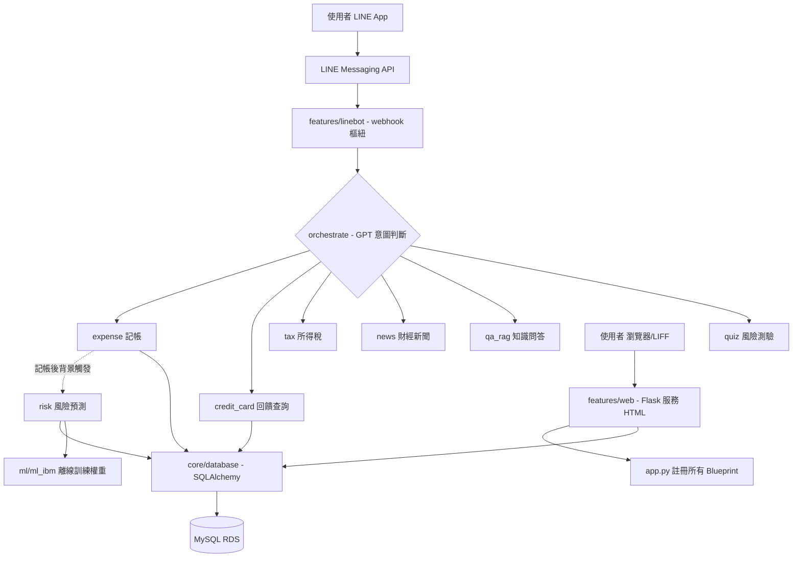
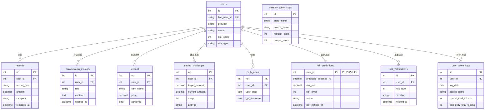

# Financial Agent

## 📘 專案簡介

Financial Agent 是一款以 **LINE Bot + Flask 後端 + MySQL** 所構成的智慧理財助理。  
使用者可直接透過 LINE 完成記帳、查詢消費、管理慾望清單、儲蓄挑戰、信用卡回饋比對、所得稅試算、財經新聞、金融知識問答等操作。  
後端採 **feature-based（垂直切分）** 架構：每個功能自成一夾（route + model + service），跨功能基礎建設集中於 `core/`，並支援 AWS EC2 部署。

---

# 🏛 系統架構圖


```mermaid
graph TD

A[使用者 LINE App] --> B[LINE Messaging API]
B --> LB[features/linebot - webhook 樞紐]
LB --> ORC{orchestrate - GPT 意圖判斷}

ORC --> F1[expense 記帳]
ORC --> F2[credit_card 回饋查詢]
ORC --> F3[tax 所得稅]
ORC --> F4[news 財經新聞]
ORC --> F5[qa_rag 知識問答]
ORC --> F6[quiz 風險測驗]
F1 -.記帳後背景觸發.-> F7[risk 風險預測]

User2[使用者 瀏覽器/LIFF] --> WEB[features/web - Flask 服務 HTML]
WEB --> APP[app.py 註冊所有 Blueprint]

F1 & F2 & F7 & WEB --> CORE[core/database - SQLAlchemy]
CORE --> DB[(MySQL RDS)]
F7 --> WT[ml/ml_ibm 離線訓練權重]
```

---

# 📦 核心功能

- 記帳（「午餐 120」）
- 消費紀錄查詢統計
- 慾望清單管理
- 儲蓄挑戰自動規劃
- AI 信用卡回饋比對
- 所得稅試算
- 每日財經新聞
- 金融知識問答（RAG）
- 財務風險預測
- LIFF 個人資料填寫（含 LINE Login）

---

# 📁 專案結構

採 feature-based（垂直切分）：每個功能自成一夾，內含自己的 route / model / service，各夾都有 `README.md`。

```
backend/
├── app.py                # 進入點：Flask 初始化、註冊 11 個 Blueprint、暖機 ML
├── core/                 # 跨功能基礎建設（不依賴任何 feature）
│   ├── database.py       #   兩個 MySQL 引擎 + Base
│   ├── token_tracker.py  #   token 計量
│   ├── token_log.py  response_logger.py  monthly_stats.py
│   └── embedder.py       #   共用嵌入模型（news + qa_rag）
├── features/
│   ├── web/              # 登入頁 / 儀表板 / LIFF API（含 liff/*.html、user model）
│   ├── linebot/          # LINE webhook 樞紐 + 對話記憶
│   ├── expense/          # 記帳（route + record model）
│   ├── credit_card/      # 回饋查詢（ai_parser/benefit_query/...）+ scrapers/ + 回饋 model
│   ├── tax/              # 所得稅試算
│   ├── wishlist/  saving_challenge/  quiz/
│   ├── news/             # 每日財經新聞 pipeline（+ rss_config、raw_data）
│   ├── risk/             # BiGRU 風險預測（+ artifacts/、risk model、ml_risk route）
│   ├── financial_status/ # 財務狀況指標
│   └── qa_rag/           # 金融知識 RAG（+ knowledge/ 向量庫）
├── static/               # 寵物動畫等靜態資源
├── tests/                # smoke / pipeline 測試
├── setup_rich_menu.py    # LINE Rich Menu 建立工具（一次性）
├── migrate_record_types.py  # 一次性 DB migration
└── requirements.txt
```

> 每個 feature 的職責、對外接口、相依見各自的 `README.md`。

---

# ⚙️ 後端架構

- `app.py`：後端主入口，註冊 Blueprint、初始化資料庫、暖機 ML
- `core/`：跨功能基礎建設（資料庫連線、token 計量、回應記錄、共用嵌入模型）
- `features/<name>/`：12 個功能模組，各自含 route / model / service 與 README
- `static/`：靜態資源；`tests/`：測試
- `setup_rich_menu.py`：LINE Rich Menu 建立工具（一次性）

---

# 🌐 LIFF / 儀表板

Flask 服務的 LIFF 頁面（`backend/features/web/liff/`）用於：
- LINE Login
- 個人資料填寫
- 顯示消費紀錄與進度條

---

# 🔌 API 一覽

> 大部分理財功能（記帳、信用卡、稅務、新聞、問答…）是透過 LINE 對話觸發，由 `/callback` 收 webhook 後在 `linebot` 內分派，**沒有獨立的 HTTP 端點**。以下為實際註冊的 HTTP 路由。

```
# LINE webhook
POST /callback

# Web / LIFF（features/web）
GET  /login_page
GET  /dashboard
POST /api/check_user
POST /api/profile/set
GET  /api/profile/get
POST /api/profile/user/profile

# 記帳（features/expense）
POST /api/expense_record/save
GET  /api/expense_history/recent
GET  /api/expense_history/summary

# 欲望清單（features/wishlist）
POST /api/wishlist/add

# 儲蓄挑戰（features/saving_challenge）
POST /api/saving-challenge/create
GET  /api/saving-challenge/list
GET  /api/saving-challenge/wishlist
POST /api/saving-challenge/feed

# 風險預測 / 財務狀況
GET  /api/ml/history
GET  /api/financial-status/
```

---

# 🗄 資料庫綱要

系統使用兩個獨立的 MySQL 資料庫（見 `backend/core/database.py`）：

- **`financial_agent`（主庫）**：使用者、記帳、對話記憶、欲望清單、儲蓄挑戰、新聞、風險預測、token 計量等。
- **`credit_card_benefits`（信用卡回饋庫）**：各銀行回饋資料，每張卡為一張結構相同的獨立表。

## ERD（主庫 `financial_agent`）

`users` 為核心，其餘表皆以 `user_id` 外鍵關聯；`risk_predictions` 每位 user 僅一筆（一對一），其餘為一對多。`monthly_token_stats` 為彙總表、無外鍵；`credit_card_benefits` 位於另一個資料庫，不在此圖。


```mermaid
erDiagram
    users ||--o{ records : "記帳"
    users ||--o{ conversation_memory : "對話記憶"
    users ||--o{ wishlist : "欲望清單"
    users ||--o{ saving_challenges : "儲蓄挑戰"
    users ||--o{ daily_news : "新聞"
    users ||--|| risk_predictions : "最新風險"
    users ||--o{ risk_notifications : "推播紀錄"
    users ||--o{ user_token_logs : "token 用量"

    users {
        int id PK
        string line_user_id UK
        string provider
        string name
        int risk_score
        string risk_type
    }
    records {
        int no PK
        int user_id FK
        string record_type
        decimal amount
        string category
        datetime recorded_at
    }
    conversation_memory {
        int id PK
        int user_id FK
        string role
        text content
        datetime expires_at
    }
    wishlist {
        int no PK
        int user_id FK
        string item_name
        decimal price
        bool achieved
    }
    saving_challenges {
        int no PK
        int user_id FK
        decimal target_amount
        decimal current_amount
        int stage
        string pettype
    }
    daily_news {
        int no PK
        int user_id FK
        text user_input
        text gpt_response
    }
    risk_predictions {
        int user_id PK "PK 同時為 FK"
        decimal predicted_expense_7d
        decimal risk_ratio
        int risk_level
        string alarm
        datetime last_notified_at
    }
    risk_notifications {
        int id PK
        int user_id FK
        int risk_level
        string direction
        datetime notified_at
    }
    user_token_logs {
        int id PK
        int user_id FK
        date log_date
        string source_name
        int openai_total_tokens
        int perplexity_total_tokens
    }
    monthly_token_stats {
        int id PK
        string stats_month
        string source_name
        int request_count
        int unique_users
    }
```

## 主庫 `financial_agent`

```sql
-- 使用者：LINE / OAuth 身分、目前互動狀態、最新風險屬性
CREATE TABLE users (
  id INT PRIMARY KEY,
  provider VARCHAR(50),
  provider_id VARCHAR(255),
  name VARCHAR(255),
  email VARCHAR(255),
  created_at DATETIME,
  line_user_id VARCHAR(64) UNIQUE,
  current_function VARCHAR(255),
  last_activity_time DATETIME,
  risk_score INT,
  risk_type VARCHAR(10)
);

-- 記帳：收支共用，以 record_type 區分（expense / income）
CREATE TABLE records (
  no INT PRIMARY KEY,
  user_id INT NOT NULL,
  record_type VARCHAR(10),
  category VARCHAR(64),
  amount DECIMAL(12,2),
  note TEXT,
  recorded_at DATETIME,
  FOREIGN KEY (user_id) REFERENCES users(id)
);

-- 短期對話記憶：帶 expires_at TTL，供 GPT 跨訊息 context
CREATE TABLE conversation_memory (
  id INT PRIMARY KEY,
  user_id INT NOT NULL,
  role VARCHAR(20),
  content TEXT,
  created_at DATETIME,
  expires_at DATETIME,
  FOREIGN KEY (user_id) REFERENCES users(id)
);

-- 欲望清單
CREATE TABLE wishlist (
  no INT PRIMARY KEY,
  user_id INT NOT NULL,
  item_name VARCHAR(255),
  price DECIMAL(10,2),
  achieved BOOLEAN,
  created_at DATETIME,
  FOREIGN KEY (user_id) REFERENCES users(id)
);

-- 儲蓄挑戰：目標金額 / 進度 / 寵物養成階段
CREATE TABLE saving_challenges (
  no INT PRIMARY KEY,
  user_id INT NOT NULL,
  item_name VARCHAR(255),
  target_amount DECIMAL(12,2),
  current_amount DECIMAL(12,2),
  stage INT,
  created_at DATETIME,
  pettype VARCHAR(64),
  FOREIGN KEY (user_id) REFERENCES users(id)
);

-- 每日新聞：使用者提問、Perplexity 原始內容、GPT 摘要
CREATE TABLE daily_news (
  no INT PRIMARY KEY,
  user_id INT NOT NULL,
  user_input TEXT,
  perplexity_scraper TEXT,
  gpt_response TEXT,
  created_at DATETIME,
  FOREIGN KEY (user_id) REFERENCES users(id)
);

-- 風險預測：每位 user 一筆最新結果，含推播冷卻欄位
CREATE TABLE risk_predictions (
  user_id INT PRIMARY KEY,
  predicted_expense_7d DECIMAL(12,2),
  monthly_income_avg DECIMAL(12,2),
  risk_ratio DECIMAL(10,4),
  risk_level INT,
  alarm VARCHAR(16),
  data_days INT,
  created_at DATETIME,
  last_notified_at DATETIME,
  last_notified_level INT,
  FOREIGN KEY (user_id) REFERENCES users(id)
);

-- 風險通知紀錄：每次實際推播一筆（升 / 降級）
CREATE TABLE risk_notifications (
  id INT PRIMARY KEY,
  user_id INT NOT NULL,
  risk_level INT,
  direction VARCHAR(16),
  notified_at DATETIME,
  FOREIGN KEY (user_id) REFERENCES users(id)
);

-- Token 用量明細：每位 user 每日每個 pipeline 一筆
CREATE TABLE user_token_logs (
  id INT PRIMARY KEY,
  user_id INT NOT NULL,
  log_date DATE,
  source_name VARCHAR(50),
  model_openai VARCHAR(50),
  model_perplexity VARCHAR(50),
  openai_prompt_tokens INT,
  openai_completion_tokens INT,
  openai_total_tokens INT,
  perplexity_prompt_tokens INT,
  perplexity_completion_tokens INT,
  perplexity_total_tokens INT,
  updated_at DATETIME,
  FOREIGN KEY (user_id) REFERENCES users(id)
);

-- Token 月統計：由 user_token_logs 彙總（見 core/monthly_stats.py）
CREATE TABLE monthly_token_stats (
  id INT PRIMARY KEY,
  stats_month VARCHAR(7),
  source_name VARCHAR(50),
  request_count INT,
  unique_users INT,
  openai_prompt_tokens INT,
  openai_completion_tokens INT,
  openai_total_tokens INT,
  perplexity_prompt_tokens INT,
  perplexity_completion_tokens INT,
  perplexity_total_tokens INT,
  updated_at DATETIME
);
```

## 信用卡回饋庫 `credit_card_benefits`

各銀行 / 卡別為一張結構相同的獨立表（如 `cube_benefits`、`ctbc_linepay_benefits`…），由 `features/credit_card/scrapers/` 爬蟲寫入，`benefit_query.py` 查詢時先 FTS 後 LIKE fallback。共同結構：

```sql
CREATE TABLE credit_card_benefits (
  id INT PRIMARY KEY,
  card_name VARCHAR(100),
  card_type VARCHAR(50),
  display_name VARCHAR(255),
  group_name VARCHAR(255),
  brands TEXT,
  reward_rate VARCHAR(50),
  brands_text TEXT
);
```

---

# 🚀 安裝與啟動

```bash
# 從專案根目錄執行
pip install -r requirements.txt
python3 -m backend.app
# 測試網址：http://localhost:8000/dashboard
```

> `torch` 需單獨安裝 CPU 版（避免拉到 >2GB 的 CUDA 套件）：
> `pip install torch --index-url https://download.pytorch.org/whl/cpu`

---

# ☁️ 部署

## SSH 連線
```bash
ssh ubuntu@<EC2_PUBLIC_IP>
```

## 安裝套件
```bash
cd financial-agent
source venv/bin/activate
# 先裝 CPU 版 torch（避免拉到 nvidia CUDA 套件）
pip install torch --index-url https://download.pytorch.org/whl/cpu
# 再裝其他套件
pip install -r requirements.txt
```

## 背景執行（systemd）
```bash
# 啟動
sudo systemctl start financial-agent
# 確認有跑起來
sudo systemctl status financial-agent --no-pager
# 看即時 log
sudo journalctl -u financial-agent -f
```

## 更新程式碼
```bash
git restore backend/features/qa_rag/knowledge/chroma_db/
git pull
sudo systemctl restart financial-agent
```

> ChromaDB 每次啟動會自動修改自己的檔案，`git restore` 先把這些變更清掉才能順利 pull。

## RAG 金融知識庫（chroma_db）更新

EC2 RAM 只有 1.9GB，`google/embeddinggemma-300m`（1.27GB）rebuild 到一半會被 OOM kill。

**務必在本機 Mac rebuild 後再 push，EC2 只做 git pull：**

```bash
# 本機 Mac 執行
venv/bin/python -m backend.features.qa_rag.rebuild_chroma
git add -f backend/features/qa_rag/knowledge/chroma_db/
git commit -m "chroma_db 再建"
git push

# EC2 執行
git restore backend/features/qa_rag/knowledge/chroma_db/
git pull
sudo systemctl restart financial-agent
```

> 不可在 EC2 上直接執行 `rebuild_chroma`。

## 停止服務
```bash
sudo systemctl stop financial-agent
```

## 重開 EC2（IP 會變）
1. 開啟 EC2 並記下新的 public IP
2. 去 NameCheap 更新 DNS / endpoint 指到新 IP
3. 更新 `.env` 的 `DB_HOST`（RDS endpoint）

---

# 📙 開發者手冊

## RDS MySQL 連線
```bash
mysql -h <RDS_ENDPOINT> -P 3306 -u <DB_USER> -p
```

## 虛擬環境
```bash
python3 -m venv venv
source venv/bin/activate
```

## 測試
```bash
# 架構冒煙測試（不需 DB）
python3 -m backend.tests.test_smoke
# 信用卡查詢 full flow
python3 -m backend.tests.test_full_flow
# 每日新聞 pipeline
python3 -m backend.tests.test_pipeline
# 信用卡爬蟲
python3 -m backend.features.credit_card.scrapers.cube_benefits_scraper
```

## Rich Menu
```bash
python3 -m backend.setup_rich_menu
```

## Git Flow
```bash
git checkout main
git pull
git checkout feature-login
git merge origin/main
```

## 時區
```bash
sudo timedatectl set-timezone Asia/Taipei
```

---

# 🔑 API Token 使用總覽

各 pipeline 完成後會向 `user_token_logs` table 寫入一筆 token 用量紀錄（source = pipeline 名稱）。

| Pipeline（source） | 觸發方式 | OpenAI 用量 | Perplexity 用量 |
|---|---|---|---|
| `credit_card` | 使用者詢問信用卡回饋 | orchestrate（意圖判斷）＋ ai_parser（品牌解析）＋ ai_reply（回覆生成） | 無 |
| `daily_news` | 使用者要求每日新聞 | orchestrate ＋ openai_news（摘要生成） | 文章不足時觸發 Perplexity fallback（sonar） |
| `expense` | 記帳（「午餐 150」） | orchestrate | 無 |
| `query_expense` | 查消費紀錄 | orchestrate | 無 |
| `wishlist` | 新增欲望清單 | orchestrate | 無 |
| `tax` | 所得稅試算 | orchestrate | 無 |
| `quiz` | 投資風險屬性測驗 | orchestrate | 無 |
| `financial_qa` | 金融知識問答 | orchestrate | 無 |
| `unknown` | 無法識別意圖 | orchestrate | 無 |

**模型版本**
- OpenAI：`gpt-4o-mini`
- Perplexity：`sonar`

**每日用量上限**：預設 50,000 OpenAI tokens／user／天，可透過 `.env` 的 `DAILY_TOKEN_LIMIT` 調整。超過上限後當天所有請求會被拒絕（Perplexity 不計入，因為 OpenAI 達上限時 pipeline 已被攔截，Perplexity 根本不會被觸發）。

**開發人員白名單**：`backend/core/token_tracker.py` 的 `WHITELIST_USER_IDS` set，填入開發人員的 `users.id`，白名單內的 user 不受每日上限限制。可執行以下 SQL 查詢 id：
```sql
SELECT id, name FROM users;
```

## 📊 Token 用量統計架構

### 資料表
| Table | 說明 |
|---|---|
| `user_token_logs` | 每筆 pipeline 執行的 token 用量，primary key 為 `(user_id, date, source)` |
| `monthly_token_stats` | 系統整體月統計，primary key 為 `(year_month, source)` |

### 月統計彙總（`backend/core/monthly_stats.py`）

從 `user_token_logs` 彙總出每個 pipeline 當月的總 token、請求次數、不同 user 數，寫入 `monthly_token_stats`。

```bash
# 彙總當月
python3 -m backend.core.monthly_stats
# 彙總指定月份
python3 -m backend.core.monthly_stats 2026-04
```

**建議排程**：在 EC2 用 cron 設定每月 1 號自動跑上個月的彙總：
```bash
# crontab -e
5 0 1 * * cd /home/ubuntu/financial-agent && source venv/bin/activate && python3 -m backend.core.monthly_stats $(date -d "last month" +\%Y-\%m)
```

---

# 🧠 ML 模組

- `backend/features/risk/`：線上風險推論。`bigru_service.predict_risk_for_user()` 載入 BiGRU ensemble 權重做即時預測。
- 模型權重在 `ml/ml_ibm/bigru_TL_alignment/artifacts_bigru_tl/`（離線訓練產物）。
- `ml/ml_walmart/`、`ml/ml_ibm/`：離線訓練實驗（GRU / BiGRU / Transfer Learning），是獨立隔離的環境，與線上服務無關，不會影響主程式。

---
