# 系統架構圖
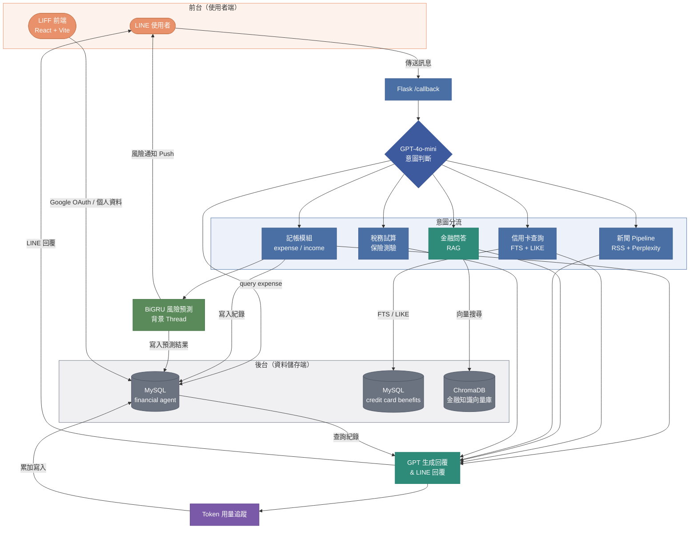

# 分層架構圖
## 第一層 
### 總覽
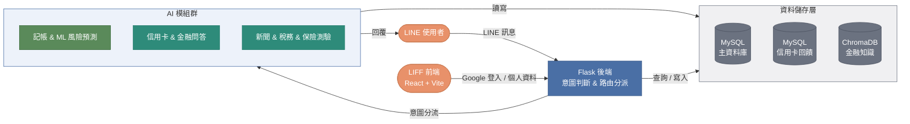

## 第二層 
### Flask
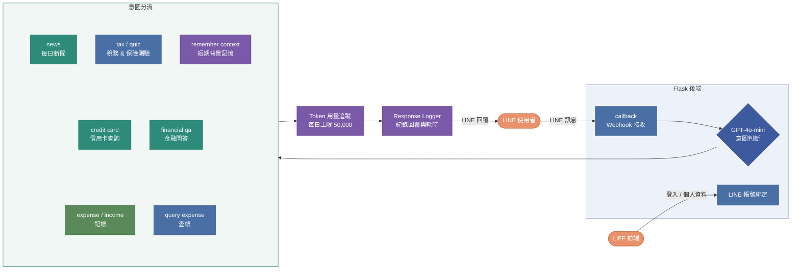
---

### DB
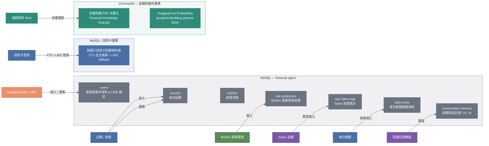
---

### 記帳 & ML 風險預測
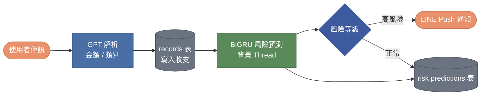

---

### 信用卡查詢
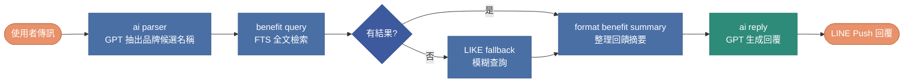
---

### 金融問答 RAG
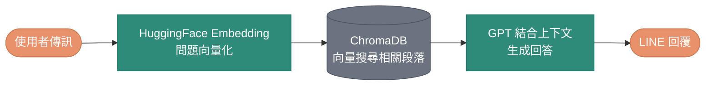

---
### 每日新聞 Pipeline
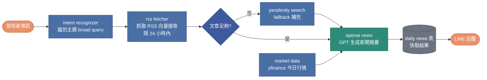

---

### 所得稅試算
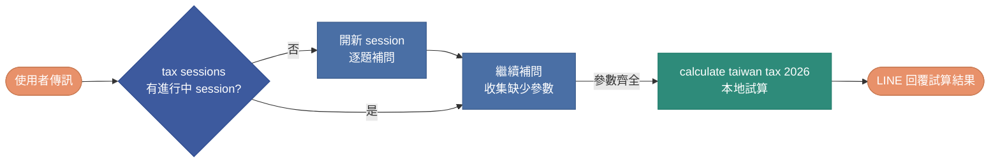

---

### 保險風險測驗
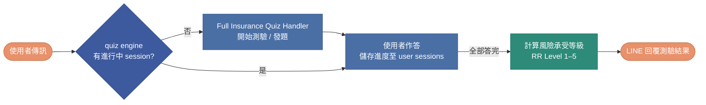
---

### 短期對話記憶
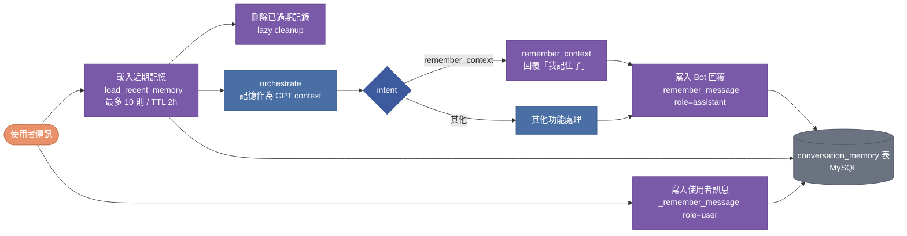

---

## 第三層
### BiGRU 風險預測 — 訓練 Pipeline
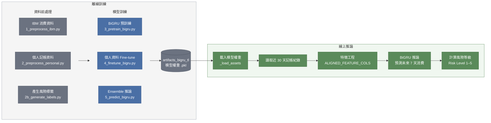

---

### 金融問答 RAG
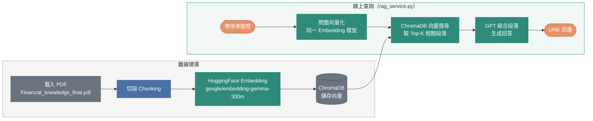

---

### 信用卡查詢 — FTS 機制
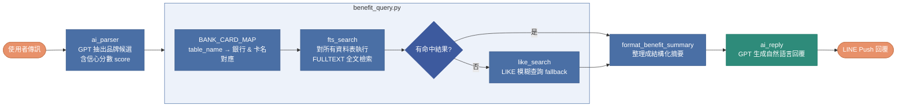
